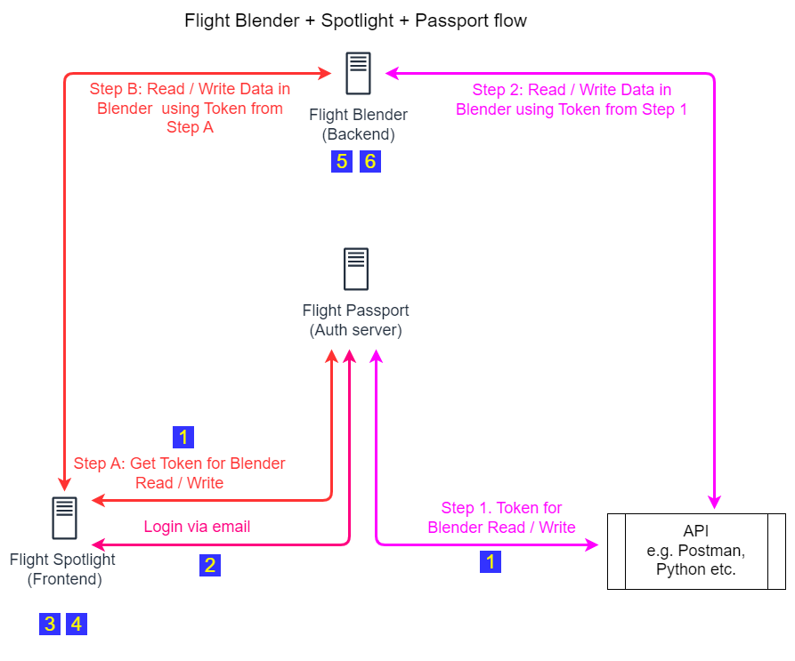
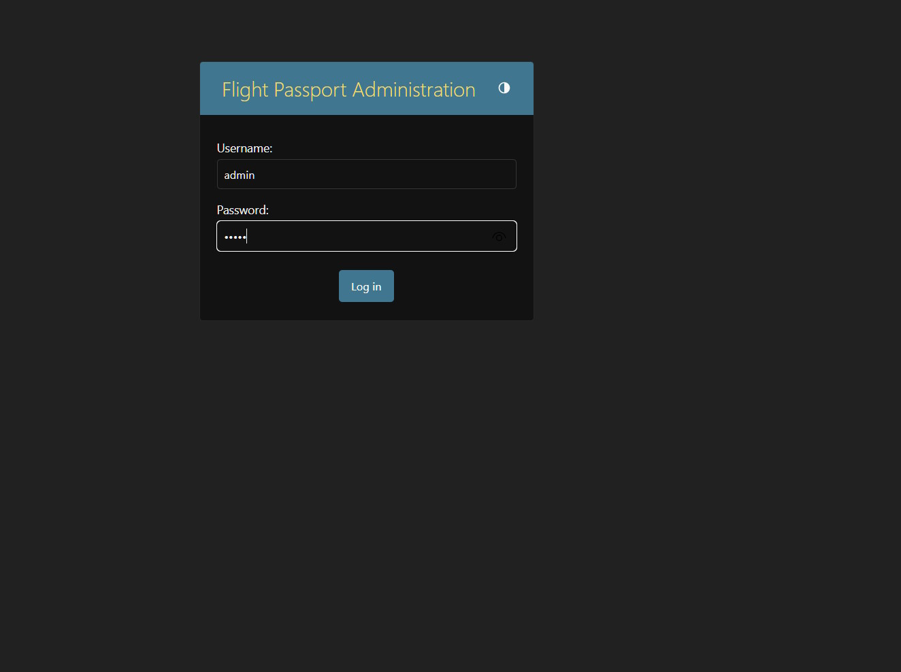
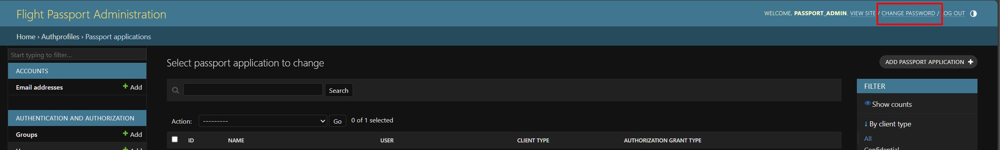
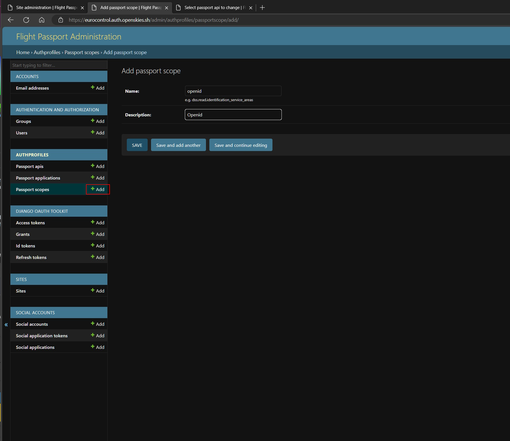
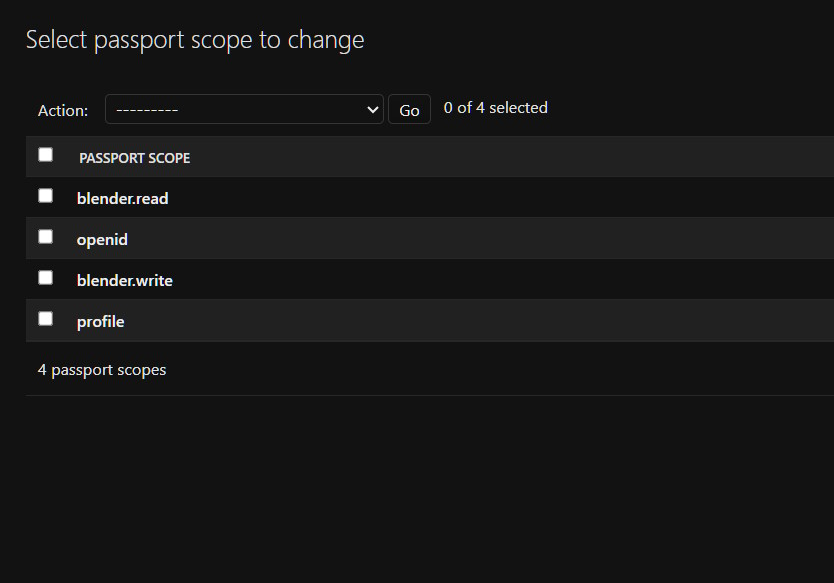
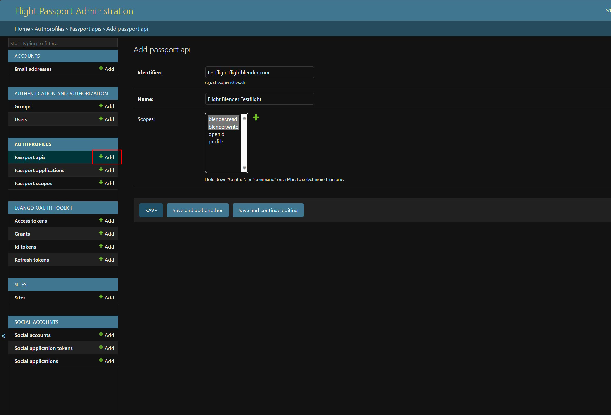
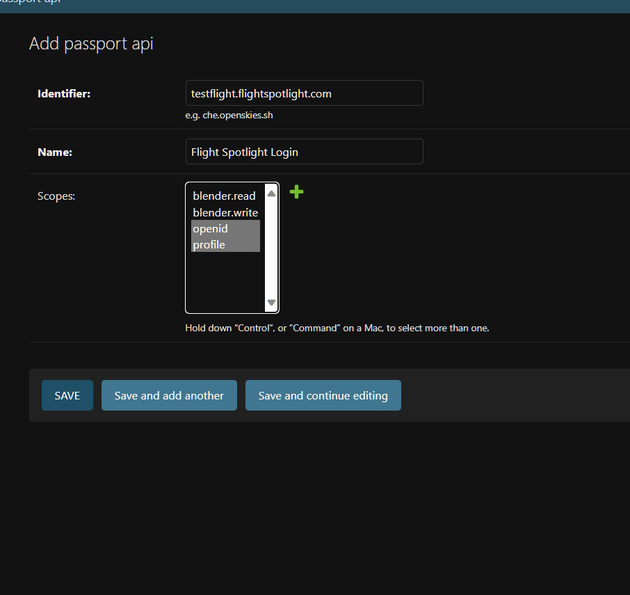
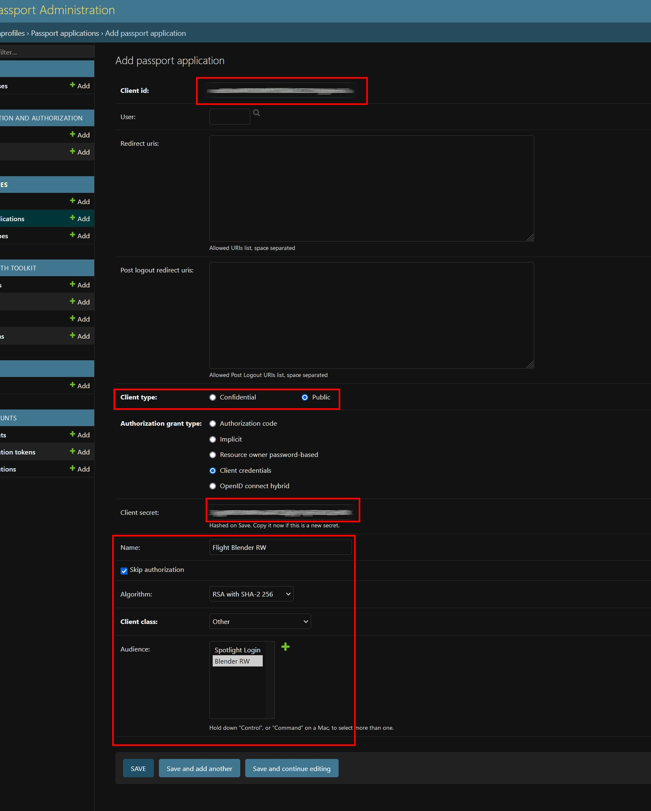
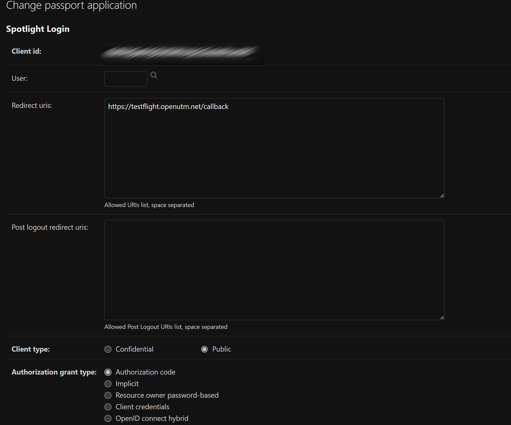
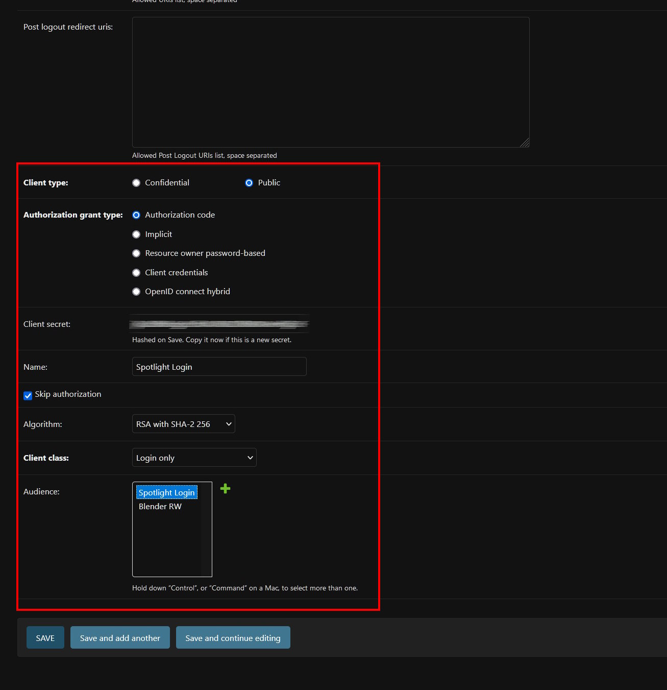

# Introduction and objective

In this article you will understand how build the environment files for the OpenUTM system. We are assuming that you will have  The general flow of this document is that you will need a Flight Passport installation running (or any other OAUTH 2.0 server) installation.

- Flight Passport (Authorization server)
- Flight Blender (Backend)
- Flight Spotlight (Frontend - optional)

## Login and change password for Flight Passport

### Login

Go to your Passport URL and then to the `/admin/` endpoint and login using the default credentials as you may have set it on your side e.g. if you are using Docker Compose and the default environment file, it is `admin` / `admin`

### Change password

It is recommended that you change the password immediately at this step. You can also change your admin username.

### Create Scopes

You will need to create four scopes (two for login / profile information and two for Flight Blender)

- `openid`
- `profile`
- `flightblender.read`
- `flightblender.write`

### Create APIs

You will need to create two apis, that define how these scopes will be used in the "application". We will create two APIs one for the login and one for reading and writing data into Flight Blender.

Note the Identifier parameter should be exactly the the same as the domain / sub-domain of Blender since tokens will be issued with `aud` parameter for this domain.

This is shown below.

You should now have two APIs and four scopes. We will now create two applications:

- One for enabling token issuance for Flight Blender
- One to enable OIDC logging in

## Create a Application for Flight Blender

Go to the Passport Applications section and add a new application. Note that the Client ID and Client secret are automatically generated and you will need to copy it before saving since the secret is hashed on save.

You can see the grant type and other settings as shown above, make sure you use the Blender RW audience that will enable the `blender.read` and `blender.write` scopes.

You will need the Client ID and Client Secret and the Passport URL to populate [Line 7-11](https://github.com/openutm/deployment/blob/main/env.examples/.spotlight.env.example#L7-L11) in the environment file. The scope should read `blender.read` `blender.write` and the audience should be `testflight.flightblender.com` or something similar (according to your domain)

## Create Application for Flight Spotlight Login

Go to the Passport Applications section and add a new application. Note that the Client ID and Client secret are automatically generated and you will need to copy it before saving since the secret is hashed on save.

You will the Client ID and Client Secret and the Callback URL to fill [Line 22-25](https://github.com/openutm/deployment/blob/main/env.examples/.spotlight.env.example#L22-L25) in the spotlight environment file with the C.

### Populate the rest of the Spotlight and Blender Environment files and deploy

After deployment, you should be able to login to the system.
