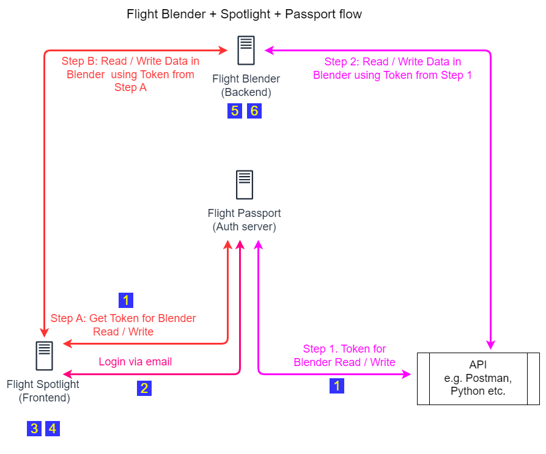

# OpenUTM Infrastucture Environment files documentation

# Introduction and objective
Environment files are crucial for configuring and managing the settings of various applications within the OpenUTM infrastructure. These files contain key-value pairs that define environment-specific variables, such as database connections, API keys, and other configuration settings. Properly setting up these environment files ensures that each component of the infrastructure operates correctly and securely.

This document provides comprehensive documentation on the environment files required for the OpenUTM infrastructure. It includes detailed explanations of the variables needed for setting up the Passport, Blender, and Spotlight components. By following this guide, you will be able to configure these components effectively and verify that the installation is working as expected.

## Overview

You will need to construct three environment files to enable the flow above. Once the environment files are constrcuted you will need to re-apply to the cluster. 

- **Flight Blender** (Backend)
- **Flight Spotlight** (Frontend - optional)
- **Flight Passport** (Authorization server)

## Passport Environment file

Use the [template](env.examples/.passport.env.example) to fill in your values. The file should be self-explanatory some notes for some of the variables are below:

- `DJANGO_SECRET_KEY`: This is a secret key used by Django for cryptographic signing. It is crucial for the security of your Django application, as it is used to provide cryptographic signing, and should be kept confidential. Never expose this key in your source code or version control. 
- `SHOW_ADMIN`: This variable determines whether the Django admin interface should be accessible. Set it to `1` to enable access to the admin interface, or `0` to disable it.
- `DOMAIN_WHITELIST`: This variable specifies a list of domains that are allowed to log in. Use a semicolon-separated list of domains, such as `openskies.sh;openutm.net`, to permit logins from these domains and prohibit others.
- `ESP_EMAIL_BACKEND`: The project uses [anymail](https://anymail.dev/en/stable/) to send transactional emails, you will need to set it up for your domain if you want to enable email verification and other features e.g. reset password via email etc. At the moment **Mailersend** and **Resend** are enabled. Check your transactional email provider and set the [backend appropriately](https://anymail.dev/en/v13.0/esps/)
- `JWT_ISSUER_DOMAIN`: Use your domain name if using locally, you can use `http://localhost:9000` or something similar this will be used to populate `iss` claim in the token
- `ENABLE_DEBUG`: This setting enables DEBUG mode in Django and can be useful for debugging, do not set this as True for prodcution 
- `DJANGO_SUPERUSER_USERNAME`: This variable sets the username for the Django superuser account. It is required for administrative access to the Django admin interface. Choose a unique and secure username.
- `DJANGO_SUPERUSER_EMAIL`: This environment variable is used to set the email address for the Django superuser. It is required when creating a superuser account through automated scripts or during the initial setup of the Django application. Ensure that this email address is valid and accessible, as it will be used for administrative purposes.
- `DJANGO_SUPERUSER_PASSWORD`: This environment variable is used to set the password for the Django superuser. It is required when creating a superuser account during the deployment process. Ensure that this password is strong and secure to protect the administrative access to your Django application.

## Blender Environment File 
Use the provided [template](env.examples/.blender.env.example) to fill in your values.

- `SECRET_KEY`: This is a secret key used by Blender for cryptographic signing. It is crucial for the security of your application and should be kept confidential. Never expose this key in your source code or version control.
- `PASSPORT_AUDIENCE`: This variable specifies the audience for the service. It should be set to `blender.$DOMAIN_NAME`, where `$DOMAIN_NAME` is your domain name. This is also the same audience that will be used when verifying tokens in a P2P UTM context. 
- `PASSPORT_URL`: This is the URL for the Passport service. It should be set to `https://passport.$DOMAIN_NAME`, where `$DOMAIN_NAME` is your domain name.
- `FLIGHTBLENDER_FQDN`: This variable specifies the fully qualified domain name (FQDN) for the Blender service. It should be set to `https://blender.$DOMAIN_NAME`, where `$DOMAIN_NAME` is your domain name.
- `REDIS_PASSWORD`: This is the password for the Redis instance used by Blender. Ensure that this password is strong and secure.
- `HEARTBEAT_RATE_SECS`: This variable sets the heartbeat rate in seconds. It determines how frequently the Blender service sends heartbeat signals.
- `IS_DEBUG`: This setting enables or disables debug mode in Blender. Set it to `1` to enable debug mode, or `0` to disable it. **Do not** enable debug mode in production.
- `DJANGO_LOG_LEVEL`: This variable sets the log level for Django. Common values are `DEBUG`, `INFO`, `WARNING`, `ERROR`, and `CRITICAL`. Set it to `INFO` for general logging.
- `POSTGRES_USER`: This is the username for the PostgreSQL database used by Blender. Ensure that this username is correct and has the necessary permissions.
- `POSTGRES_PASSWORD`: This is the password for the PostgreSQL database used by Blender. Ensure that this password is strong and secure.
- `POSTGRES_DB`: This variable specifies the name of the PostgreSQL database used by Blender. Ensure that this database exists and is accessible.
- `ENABLE_CONFORMANCE_MONITORING`: This variable enables or disables conformance monitoring tasks for Blender
- `USSP_NETWORK_ENABLED`: This variable controls whether Flight Blender runs by itself or is connected to a DSS e.g. interuss/dss system to share operational intents.
- `USE_CUSTOM_VOLUME_GENERATION`: This variable controls how operational intent volumes are generated, use this to by pass the default operational intent generation
- `ASTM_F3623_SDSP_CUSTOM_DATA_FUSER_CLASS`: This variable enables custom data fusion code to generate Aircraft Tracks for the Surveillance SDSP.
- `DISABLE_JSON_LOGGING`: Set as 0 or 1, to disable JSON logging, JSON logging is useful for production deployments but you may want to disable it for local development

### DSS configuration variables
These variables link your Blender instance to a discovery and synchronization service e.g. [interuss/dss](https://www.github.com/interuss/dss). We recommend first setting `USSP_NETWORK_ENABLED` as 0, once you are familiar with how Flight Blender works, then setup the DSS connection. 

- `DSS_SELF_AUDIENCE`: The intended audience for the DSS (Discovery and Synchronization Service) tokens, typically set to the hostname or identifier of the local environment.
- `AUTH_DSS_CLIENT_ID`: The client ID used for authenticating with the DSS authorization server.
- `AUTH_DSS_CLIENT_SECRET`: The client secret associated with the DSS client ID, used for secure authentication.
- `DSS_BASE_URL`: The base URL for accessing the DSS API endpoints.
- `DSS_AUTH_URL`: The URL of the DSS authorization server, used for obtaining authentication tokens.
- `DSS_AUTH_TOKEN_ENDPOINT`: The endpoint path on the authorization server for requesting authentication tokens.
- `DSS_AUTH_JWKS_ENDPOINT`: The endpoint URL for retrieving the JSON Web Key Set (JWKS) used to validate JWT tokens issued by the authorization server.

## Spotlight Environment File 
Use the [template](env.examples/.spotlight.env.example) to fill in your values. 

- `SECRET`: The `SECRET` variable is required by the express-openid-connect library to sign and verify session cookies and tokens. It should be a long, random, and secure string to ensure the integrity and confidentiality of authentication sessions. Never share this secret publicly or commit it to version control. For production environments, generate a strong secret and store it securely, such as in environment variables or a secrets manager.
- `PASSPORT_URL`: This is the URL for the Passport service. It should be set to `https://passport.$DOMAIN_NAME`, where `$DOMAIN_NAME` is your domain name.
- `BLENDER_BASE_URL`: This is the base URL for the Blender service. It should be set to `http://blender:8000`.
- `PASSPORT_BLENDER_CLIENT_ID`: This is the client ID for the Blender service to authenticate with the Passport service.
- `PASSPORT_BLENDER_CLIENT_SECRET`: This is the client secret for the Blender service to authenticate with the Passport service. Keep this value confidential.
- `PASSPORT_BLENDER_SCOPE`: This variable specifies the scope of access for the Blender service. It should be set to `blender.read blender.write` without any quotes.
- `PASSPORT_BLENDER_AUDIENCE`: This variable specifies the audience for the Blender service. It should be set to `blender.$DOMAIN_NAME`, where `$DOMAIN_NAME` is your domain name.
- `MAPBOX_KEY`: This is the API key for Mapbox Maps. It is used for mapping services within the Spotlight application.
- `DEFAULT_APPROVED`: This variable sets the default approval status. Set it to `1` to enable default approval.
- `OIDC_DOMAIN`: This is the OpenID Connect (OIDC) domain for the Passport service. It should be set to `https://passport.$DOMAIN_NAME/o`, where `$DOMAIN_NAME` is your domain name.
- `CLIENT_ID`: This is the client ID for the Spotlight application to authenticate with the OIDC provider.
- `CLIENT_SECRET`: This is the client secret for the Spotlight application to authenticate with the OIDC provider. Keep this value confidential.
- `SPOTLIGHT_BASE_URL`: This is the base URL for the Spotlight application. It should be set to `https://spotlight.$DOMAIN_NAME`, where `$DOMAIN_NAME` is your domain name.
- `REDIS_PASSWORD`: This is the password for the Redis instance used by Spotlight. Ensure that this password is strong and secure.